# 🏗️ System Architecture

## 1. Tổng quan dự án

Mojin Air Chat được xây dựng theo mô hình **Decoupled Architecture**, trong đó Frontend và Backend được phát triển độc lập và giao tiếp thông qua REST API.

Frontend sử dụng Next.js để xây dựng giao diện người dùng, trong khi TanStack Query được sử dụng để quản lý Server State và đồng bộ dữ liệu với Backend. Backend sử dụng **Laravel** để xử lý nghiệp vụ, xác thực người dùng, quản lý dữ liệu và phát sự kiện Realtime thông qua Pusher hoặc Laravel Reverb.

Kiến trúc này giúp việc bảo trì, mở rộng và triển khai từng thành phần trở nên dễ dàng hơn.

## 2. Kiến trúc tổng thể

Dự án được xây dựng theo mô hình **Decoupled Architecture**, trong đó Frontend và Backend được triển khai độc lập và giao tiếp thông qua REST API. Các dịch vụ bên thứ ba như Cloudinary và Pusher được sử dụng để xử lý lưu trữ tệp và truyền dữ liệu Realtime.

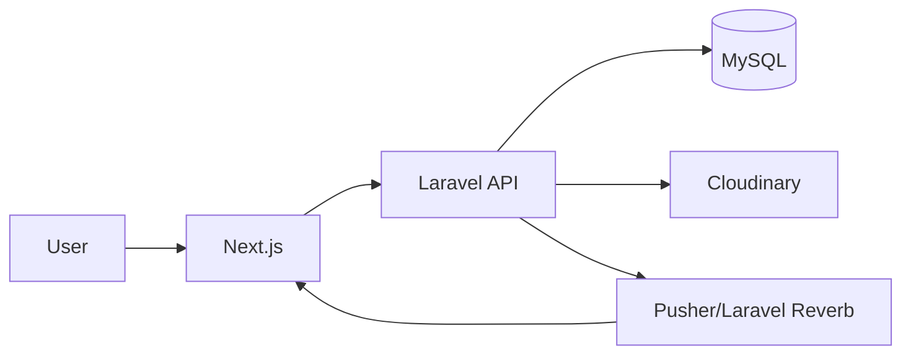

### Giải thích

- **Next.js** chịu trách nhiệm hiển thị giao diện và gửi yêu cầu đến Backend.
- **Laravel API** xử lý toàn bộ nghiệp vụ của hệ thống.
- **MySQL** lưu trữ dữ liệu chính của ứng dụng.
- **Cloudinary** quản lý hình ảnh và tệp đính kèm.
- **Pusher / Laravel Reverb** phát sự kiện Realtime để các client nhận được dữ liệu ngay lập tức.

## 3. Frontend Architecture

Frontend được phát triển bằng Next.js App Router.

Các thành phần chính bao gồm:

- **App Router** để tổ chức routing.
- **TanStack Query** để quản lý dữ liệu từ server.
- **Zustand** để lưu trữ các state phía client như Authentication, Theme và UI.
- **Tailwind CSS** để xây dựng giao diện.

### Flow

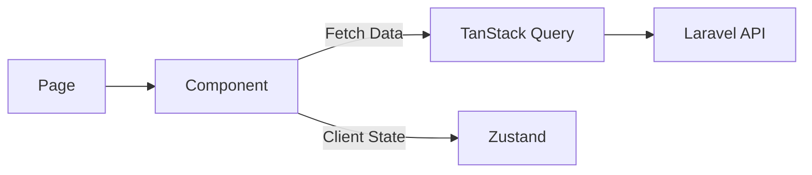

## 4. Backend Architecture

Backend được phát triển bằng Laravel 12.

Các thành phần chính bao gồm:

- **Request:** Tiếp nhận dữ liệu từ phía Client.
- **Route:** Điều hướng request đến Controller tương ứng.
- **Controller:** Xử lý nghiệp vụ và điều phối luồng xử lý.
- **Model:** Thực hiện truy vấn và thao tác với cơ sở dữ liệu.
- **Database:** Lưu trữ dữ liệu của hệ thống.

### Flow

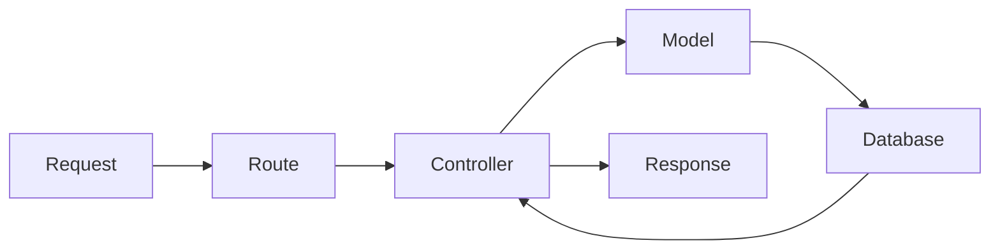

## 5. Data Flow

### 5.1 User Authentication

Người dùng đăng nhập vào hệ thống thông qua email và mật khẩu. Backend xác thực thông tin tài khoản, sau đó trả về Access Token (hoặc Session) để Frontend lưu trạng thái đăng nhập và truy cập các tài nguyên được bảo vệ.

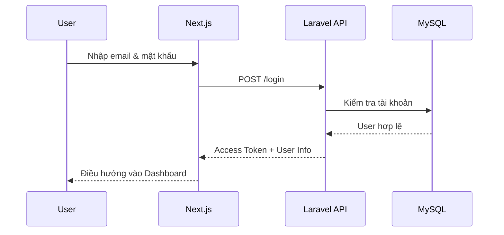

### 5.2 Add Friend

Người dùng tìm kiếm tài khoản khác và gửi lời mời kết bạn. Sau khi người nhận chấp nhận lời mời, hệ thống tạo mối quan hệ bạn bè và đồng bộ danh sách bạn bè giữa hai người dùng.

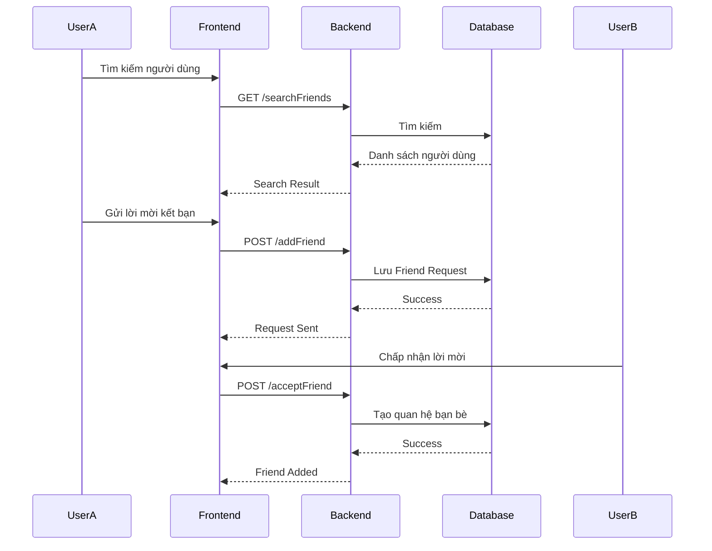

### 5.3 Send Message

Đây là luồng xử lý chính của hệ thống. Sau khi người dùng gửi tin nhắn, Backend kiểm tra dữ liệu, lưu vào cơ sở dữ liệu rồi trả kết quả về cho Frontend.

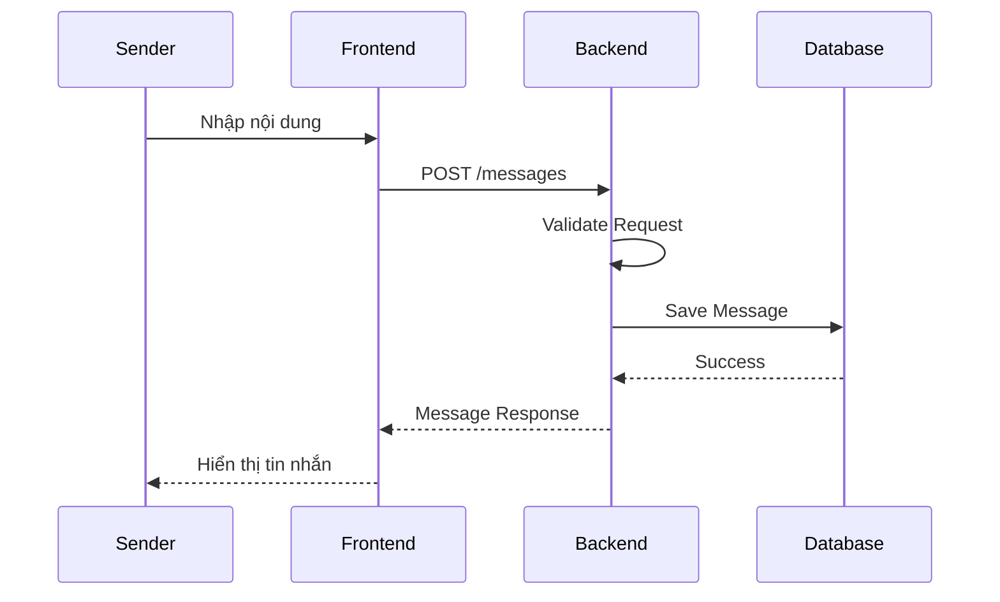

### 5.4 Upload Image

Khi người dùng gửi hình ảnh, Frontend hiển thị ảnh xem trước bằng Blob URL để tăng trải nghiệm người dùng. Sau đó ảnh được tải lên Cloudinary và URL trả về sẽ được lưu vào cơ sở dữ liệu.

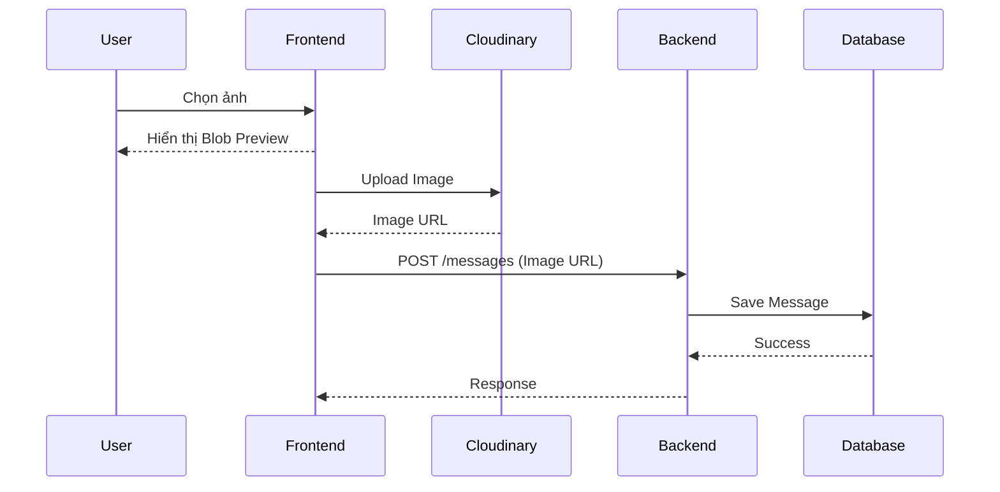

💡 Lưu ý: Để cải thiện trải nghiệm người dùng, giao diện sử dụng Optimistic UI bằng cách hiển thị ảnh xem trước trước khi quá trình tải lên Cloudinary hoàn tất.

## 6. Realtime Flow

Hệ thống sử dụng **Laravel Broadcasting** kết hợp với **Pusher** hoặc **Laravel Reverb** để đồng bộ dữ liệu theo thời gian thực giữa các người dùng. Sau khi một sự kiện xảy ra ở Backend, hệ thống sẽ phát Broadcast Event để các client đang lắng nghe cập nhật giao diện mà không cần tải lại trang.

### 6.1 New Message

Sau khi Backend lưu tin nhắn thành công, hệ thống phát sự kiện Realtime để các người dùng khác trong cuộc trò chuyện nhận được tin nhắn ngay lập tức mà không cần tải lại trang.

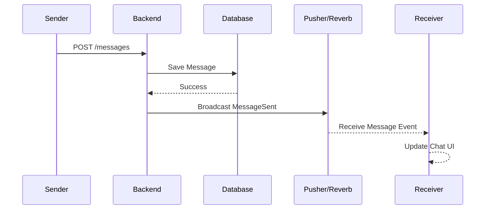

---

### 6.2 Typing Indicator

Khi người dùng đang nhập nội dung, Frontend gửi trạng thái typing đến Backend. Backend phát sự kiện Realtime để người còn lại biết rằng đối phương đang nhập tin nhắn.

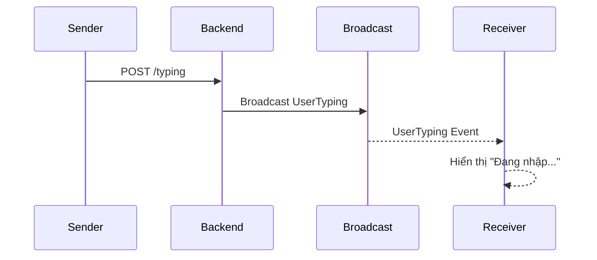

---

### 6.3 Friendship Events

Các thao tác như gửi lời mời kết bạn, chấp nhận lời mời, hủy kết bạn hoặc chặn người dùng đều phát Broadcast Event để đồng bộ trạng thái giữa hai người dùng mà không cần tải lại trang.

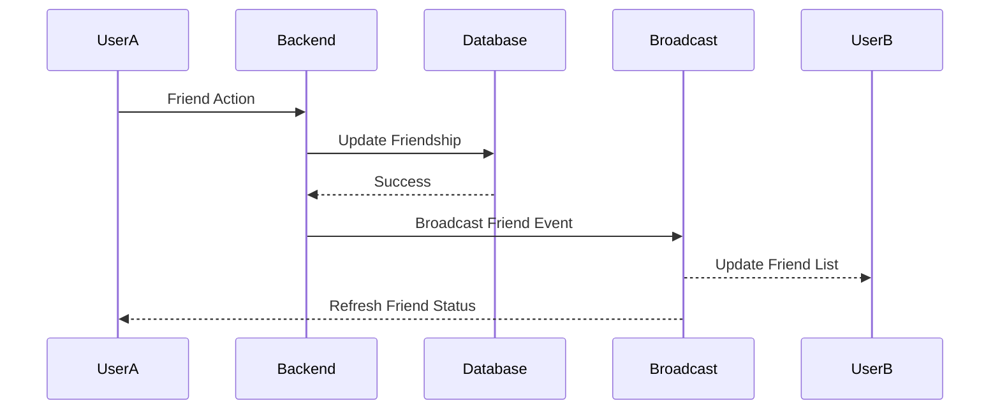

> Các Broadcast Event được sử dụng gồm: `FriendRequestSent`, `FriendRequestAccepted`, `FriendshipDeleted`, `FriendBlocked` và `FriendUnblocked`.

---

### 6.4 Group Events

Đối với các cuộc trò chuyện nhóm, hệ thống phát sự kiện Realtime khi nhóm được tạo hoặc khi thành viên được thêm/xóa khỏi nhóm để đồng bộ danh sách thành viên giữa tất cả người tham gia.

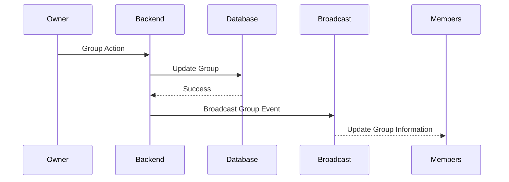

> Các Broadcast Event bao gồm: `GroupCreated`, `GroupAddParticipants` và `GroupRemoveParticipants`.

---

### 6.5 User Presence

Khi trạng thái người dùng thay đổi (Online/Offline), Backend phát sự kiện Realtime để cập nhật trạng thái trên danh sách bạn bè và các cuộc trò chuyện đang mở.

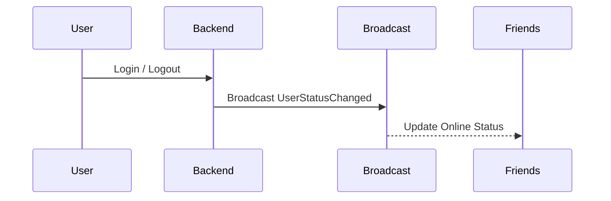

## 7. Folder Structure

Dự án được chia thành hai phần chính là Frontend và Backend nhằm tách biệt giao diện người dùng với phần xử lý nghiệp vụ.

```text
Mojin_Air_Chat
│
├── backend/
│   ├── app/
│   │   ├── Http/
│   │   │   ├── Controllers/
│   │   │   ├── Middleware/
│   │   │   └── Requests/
│   │   ├── Events/
│   │   ├── Models/
│   │   └── Policies/
│   ├── database/
│   └── routes/
│
├── frontend/
│   ├── app/
│   ├── components/
│   ├── hooks/
│   ├── lib/
│   ├── stores/
│   ├── services/
│   └── types/
│
└── docs/
```

### Giải thích

- **backend/**: Chứa toàn bộ mã nguồn Laravel.
- **frontend/**: Chứa giao diện Next.js.
- **docs/**: Chứa tài liệu kỹ thuật của dự án.

## 8. Future Architecture

Trong quá trình phát triển dự án, mình nhận thấy vẫn còn một số điểm có thể cải thiện để hệ thống dễ mở rộng và bảo trì hơn trong tương lai.

### Backend

- Refactor Controller theo mô hình **Controller → Service → Repository** để giảm lượng business logic trong Controller.
- Bổ sung Unit Test và Feature Test cho các API quan trọng.
- Chuyển Queue sang Redis thay vì sử dụng `sync` trong môi trường Production.

### Frontend

- Tách các Component lớn thành các Component nhỏ hơn để dễ tái sử dụng.
- Tiếp tục tối ưu việc quản lý cache của TanStack Query.
- Cải thiện khả năng xử lý lỗi và trạng thái loading.

### Infrastructure

- Thêm tính năng Call Video bằng WebRTC
- Thêm tính năng Voice Messange, Message Search, Message Reaction, Push Notification New Message
- Thay đổi theme cho từng hộp hội thoại
- Dockerize Backend để đơn giản hóa quá trình triển khai.
- Triển khai ứng dụng lên môi trường Cloud để phục vụ việc kiểm thử và sử dụng.
- Tiếp tục tìm hiểu quy trình CI/CD để tự động hóa việc Build và Deploy trong tương lai.