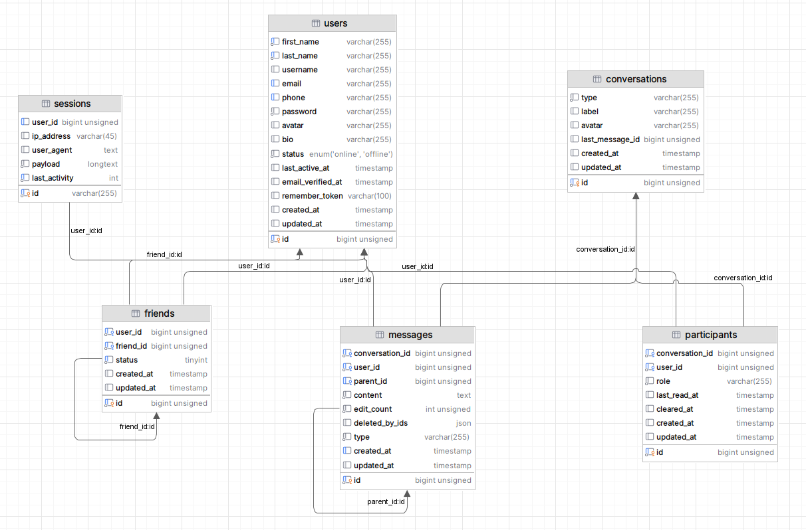

# 🗄️ Database Design

## 1. Design Goals (Mục tiêu thiết kế)

Hệ thống cơ sở dữ liệu của **Mojin Air Chat** được thiết kế nhằm phục vụ kiến trúc ứng dụng trò chuyện thời gian thực (Real-time Chat Engine) hiệu năng cao, hướng đến sự cân bằng giữa tốc độ truy vấn và tính linh hoạt khi mở rộng.

- **Kiến trúc phòng chat hợp nhất:** Hỗ trợ linh hoạt cả cuộc trò chuyện cá nhân (Direct Message) và cuộc trò chuyện nhóm (Group Chat) trên cùng một thực thể, giảm thiểu việc nhân bản cấu trúc bảng.
- **Triệt tiêu JOIN thừa thãi:** Lưu trữ payload phức tạp dưới dạng dữ liệu bán cấu trúc, hạn chế tối đa các câu lệnh kết nối nhiều bảng (Multi-table JOINs) khi tải lịch sử chat nhằm đảm bảo độ trễ truy vấn luôn dưới 5ms.
- **Tối ưu hóa Index tần suất cao:** Thiết lập các chỉ mục thông minh trên các trường thường xuyên quét để gánh tải hệ thống khi lượng request tăng đột biến.
- **Cô lập trạng thái cục bộ:** Lưu vết hành vi người dùng (như thời điểm xóa lịch sử chat, mốc đọc tin nhắn sau cùng) độc lập cho từng thành viên, không gây ảnh hưởng hay làm ô nhiễm dữ liệu của thành viên khác trong cùng phòng.

---

## 2. Entity Relationship Diagram (ERD)

  

> Hệ thống bao gồm 5 nhóm thực thể chính: **Users, Friends, Conversations, Participants** và **Messages**. Các bảng được thiết kế tách biệt trách nhiệm (Separation of Concerns) nhằm giảm tối đa sự phụ thuộc tuyến tính giữa các module.

---

## 3. Detailed Schema Design (Chi tiết thiết kế các bảng)

Chương này phân tích sâu vai trò, trách nhiệm, mối quan hệ thực thể và ý nghĩa của các trường dữ liệu đặc biệt được triển khai trong hệ thống.

---

### 3.1 Users Table

> **Mục đích:** Bảng trung tâm lưu trữ danh tính người dùng, quản lý phiên xác thực, cấu hình hồ sơ cá nhân và trạng thái hiện diện (Presence Status) toàn cục.

- **Mối quan hệ (Relationships):**
  - `One-to-Many`: Một người dùng có thể khởi tạo và gửi nhiều tin nhắn (`messages`).
  - `Many-to-Many`: Một người dùng có thể tham gia vào nhiều cuộc hội thoại độc lập thông qua bảng trung gian `participants`.
  - `Many-to-Many`: Một người dùng thiết lập quan hệ bạn bè tự tham chiếu với nhiều tài khoản khác thông qua bảng chéo `friends`.
- **Các trường đặc biệt (Special Columns):**
  - `last_active_at`: Kiểu dữ liệu `timestamp`, ghi vết mốc thời gian tương tác cuối cùng của client lên hệ thống, làm cơ sở quét dữ liệu để tự động hóa tính toán trạng thái ẩn/hiện.
  - `status`: Trạng thái hiện diện thực tế, nhận trị cứng (`online` / `offline`). Cờ này thay đổi sẽ kích hoạt Broadcast Event để đồng bộ tức thì sang danh sách bạn bè của các client khác.

---

### 3.2 Friends Table

> **Mục đích:** Quản lý mối quan hệ bạn bè và các rào cản cô lập bảo mật giữa các tài khoản. Thay vì lưu trữ mảng ID phức tạp gây phân mảnh, hệ thống ứng dụng mô hình chéo tự tham chiếu (Self-referencing Many-to-Many).

- **Mối quan hệ (Relationships):**
  - Bản ghi đóng vai trò là một liên kết chéo giữa hai thực thể: `user_id` (người chủ động tương tác) và `friend_id` (người nhận tương tác) trỏ ngược về khóa chính `id` của bảng `users`.
- **Các trường đặc biệt (Special Columns):**
  - `status`: Sử dụng kiểu dữ liệu số (`0`, `1`, `2`) để quản lý nghiêm ngặt vòng đời quan hệ:
    - `0`: **Pending** (Đang chờ đối phương phê duyệt lời mời kết bạn).
    - `1`: **Accepted** (Đã trở thành bạn bè, mở khóa quyền thiết lập phòng chat đôi).
    - `2`: **Blocked** (Đã chặn đối phương, đóng băng hoàn toàn luồng truyền dẫn tin nhắn).

---

### 3.3 Conversations Table

> **Mục đích:** Lưu trữ thông tin định danh cơ bản của phòng chat và làm bộ đệm cache tin nhắn sau cùng. Bảng này đóng vai trò như một "bộ định tuyến" hội thoại mà không trực tiếp chứa thông tin thành viên.

- **Phân loại phòng chat (Type Layout):**
  - `type = 'private'`: Cuộc trò chuyện đôi (Direct Message). Hệ thống sẽ áp Middleware kiểm tra quan hệ bạn bè (`status = 1`) dưới DB trước khi cấp quyền ghi dữ liệu.
  - `type = 'group'`: Cuộc trò chuyện nhóm (Group Chat). Bỏ qua ràng buộc kết bạn cá nhân, định danh các cấp độ quản trị viên thông qua thực thể trung gian.
- **Các trường đặc biệt (Special Columns):**
  - `last_message_id`: Khóa ngoại lưu vết trực tiếp ID của tin nhắn mới nhất, phục vụ tăng tốc độ render Inbox Dashboard mà không cần truy vấn quét lịch sử bảng tin nhắn.

---

### 3.4 Participants Table

> **Mục đích:** Giải quyết mối quan hệ Nhiều-Nhiều (Many-to-Many) giữa `users` và `conversations`. Đây là nơi cô lập toàn bộ các cấu hình trải nghiệm và lưu vết hành vi cá nhân của từng thành viên trong một phòng chat.

- **Mối quan hệ (Relationships):**
  - Thiết lập liên kết khóa ngoại song song trỏ về `user_id` -> `users(id)` và `conversation_id` -> `conversations(id)`.
- **Các trường đặc biệt (Special Columns):**
  - `role`: Định vị vai trò phân quyền thành viên trong phòng chat nhóm (`creator`, `member`) để kiểm soát tác vụ kích hoặc thêm người.
  - `last_read_at`: Mốc thời gian `timestamp` đọc tin nhắn sau cùng, dùng để đối chiếu với mốc cập nhật phòng chat nhằm tính toán trạng thái chưa đọc (Unread Status) bất đồng bộ.
  - `cleared_at`: Mốc thời gian xử lý tính năng "Xóa lịch sử trò chuyện phía tôi". Khi tải lịch sử chat, hệ thống chỉ kết xuất các tin nhắn có `created_at` lớn hơn mốc này.

---

### 3.5 Messages Table

> **Mục đích:** Trung tâm lưu trữ toàn bộ lịch sử trao đổi thông tin. Toàn bộ cấu trúc payload đa phương tiện phức tạp được quy hoạch gọn gàng trong một thực thể duy nhất để đạt tốc độ ghi/đọc tối đa.

- **Mối quan hệ (Relationships):**
  - Kết nối trực tiếp khóa ngoại thông qua `conversation_id` -> `conversations(id)` và `user_id` -> `users(id)`.
  - Thiết lập mối quan hệ tự tham chiếu (Self-referencing 1-Many) qua trường `parent_id` trỏ ngược về `id` của chính bảng `messages`.
- **Các trường đặc biệt (Special Columns):**
  - `content`: Kiểu dữ liệu **JSON**. Lưu trữ payload đa phương tiện linh hoạt (chuỗi text thô, mảng URL hình ảnh Cloudinary, thông tin file đính kèm).
  - `type`: Xác định kiểu hiển thị giao diện gồm: `text`, `image`, `file`, `mixed`, `system`.
  - `parent_id`: Lưu ID của tin nhắn gốc để phục vụ tính năng **Reply Message**. Nếu bằng `NULL` nghĩa là tin nhắn độc lập.
  - `deleted_by_ids`: Lưu mảng JSON chứa ID các User đã thực hiện lệnh ẩn tin nhắn ở chế độ **Delete for me** để dọn sạch UI phía họ.
  - `edit_count`: Đếm số lần chỉnh sửa của một tin nhắn, mặc định bằng `0` và lũy tiến mỗi khi có tác vụ cập nhật nội dung.

---

## 8. Design Decisions (Các quyết định thiết kế hệ thống)

Chương này ghi lại các quyết định kiến trúc cốt lõi trong quá trình thiết kế cơ sở dữ liệu và phân bổ nghiệp vụ, làm nền tảng để bảo trì và phản biện kiến trúc dự án.

---

### 8.1 Cơ chế quản lý mối quan hệ bạn bè tập trung (Single-Table Friendship)

> **Quyết định:** Gom toàn bộ logic gửi lời mời, kết bạn, hủy kết bạn và chặn (Block) vào duy nhất một bảng `friends` trung gian, điều hướng trạng thái thông qua trường `status`.

- **Lý do lựa chọn (Why?):** Tránh việc phân mảnh dữ liệu ra nhiều bảng phụ như `friend_requests` hay `blocked_users`. Khi cần kiểm tra hai người dùng có đủ điều kiện thiết lập luồng chat đôi hay không, Laravel chỉ cần thực hiện duy nhất một câu lệnh SQL kiểm tra điều kiện trên bảng này, giảm thiểu tải truy vấn tối đa.
- **Hệ quả & Đánh đổi (Trade-off):** Logic xử lý tại tầng Controller và các câu lệnh điều kiện phức tạp (State Transitions) sẽ phình to hơn do phải bắt và xử lý nhiều kịch bản chuyển đổi trạng thái chéo trên cùng một thực thể.

---

### 8.2 Cô lập trạng thái hội thoại cá nhân (Isolated Participant State)

> **Quyết định:** Thiết kế mối quan hệ Nhiều-Nhiều giữa User và Conversation thông qua bảng trung gian `participants`, đồng thời tích hợp các trường trạng thái cá nhân bao gồm `role`, `last_read_at` và `cleared_at`.

- **Lý do lựa chọn (Why?):** Đảm bảo tính độc lập trải nghiệm của từng thành viên trong phòng chat. Ví dụ: Khi User A chọn xóa lịch sử chat, hệ thống cập nhật `cleared_at` của riêng User A để ẩn tin nhắn đi, trong khi toàn bộ lịch sử hội thoại của User B vẫn được giữ nguyên vẹn không bị ảnh hưởng.
- **Hệ quả & Đánh đổi (Trade-off):** Dung lượng lưu trữ của bảng trung gian `participants` sẽ tăng trưởng rất nhanh theo cấp số nhân khi số lượng thành viên trong các phòng Group Chat gia tăng.

---

### 8.3 Chuẩn hóa Payload tin nhắn hỗn hợp (Unified Message Type)

> **Quyết định:** Sử dụng duy nhất bảng `messages` để quản lý toàn bộ nội dung hội thoại, phân loại cơ chế hiển thị giao diện thông qua trường `type` (`text`, `image`, `file`, `mixed`, `system`).

- **Lý do lựa chọn (Why?):** Giúp toàn bộ dòng chảy lịch sử trò chuyện được quy hoạch đồng nhất về một nơi. Phía Frontend (Next.js) chỉ cần bóc tách trường `type` là có thể lập tức quyết định phương thức render UI tương ứng mà không cần bận tâm đến việc truy vấn dữ liệu từ các bảng phụ.
- **Hệ quả & Đánh đổi (Trade-off):** Đối với các loại dữ liệu phức tạp (như tin nhắn hỗn hợp `mixed`), hệ thống bắt buộc phải thực hiện parse chuỗi dữ liệu trước khi kết xuất thông tin ra giao diện.

---

### 8.4 Thiết lập luồng phản hồi đệ quy (Self-Referencing Reply)

> **Quyết định:** Tích hợp trường `parent_id` kiểu Nullable trỏ ngược về khóa chính `id` của chính bảng `messages` để xử lý tính năng trả lời tin nhắn (Reply Thread).

- **Lý do lựa chọn (Why?):** Triệt tiêu hoàn toàn việc phải đẻ thêm một bảng mới để quản lý luồng phản hồi. Một thực thể tin nhắn có thể dễ dàng thiết lập liên kết và truy cập trực tiếp đến cấu trúc dữ liệu của tin nhắn gốc chỉ với một mối quan hệ Eloquent đơn giản.
- **Hệ quả & Đánh đổi (Trade-off):** Khi thực hiện câu lệnh lấy dữ liệu lịch sử chat, bắt buộc phải thực hiện Eager Loading quan hệ `parent` để tránh rơi vào bẫy truy vấn $N+1$ chí mạng.

---

### 8.5 Cơ chế xóa mềm phân rã theo thực thể (Soft Delete per User)

> **Quyết định:** Sử dụng kết hợp trường `deleted_by_ids` (định dạng mảng JSON) và trường `cleared_at` để quản lý hành vi ẩn/xóa tin nhắn phía client mà đéo sử dụng cơ chế SoftDeletes mặc định của Laravel.

- **Lý do lựa chọn (Why?):** Đáp ứng trọn vẹn nghiệp vụ chat thực tế: Tin nhắn bị ẩn đi ở giao diện người này nhưng vẫn phải hiển thị đầy đủ ở giao diện người kia cho đến khi đối phương chủ động thực hiện lệnh xóa.
- **Hệ quả & Đánh đổi (Trade-off):** Làm tăng độ phức tạp của các câu lệnh Eloquent Query toàn cục, do hệ thống luôn phải thực hiện các bộ lọc kiểm tra sự tồn tại của ID người dùng hiện tại bên trong mảng JSON `deleted_by_ids`.

---

### 8.6 Tối ưu hóa truy vấn tin nhắn sau cùng (Last Message Cache)

> **Quyết định:** Lưu trữ trực tiếp khóa ngoại `last_message_id` ngay tại bảng `conversations`.

- **Lý do lựa chọn (Why?):** Khi người dùng mở hộp thư đến (Inbox Dashboard), hệ thống chỉ cần truy vấn trực tiếp thông tin từ bảng `conversations` để hiển thị nội dung tin nhắn mới nhất, thay vì phải thực hiện câu lệnh `MAX(id)` hoặc quét ngầm toàn bộ lịch sử của từng phòng chat, giúp tiết kiệm tối đa tài nguyên cơ sở dữ liệu.
- **Hệ quả & Đánh đổi (Trade-off):** Đánh đổi bằng tài nguyên ghi ghi (Write Overhead). Cứ mỗi khi xảy ra tác vụ gửi, chỉnh sửa hoặc xóa tin nhắn, hệ thống bắt buộc phải kích hoạt một lệnh phụ để cập nhật lại trường `last_message_id`.

---

### 8.7 Kiến trúc hướng sự kiện thời gian thực (Event-Driven Realtime)

> **Quyết định:** Toàn bộ các biến động dữ liệu hội thoại (gửi, sửa, xóa, typing, online/offline, bạn bè) đều được kích hoạt thông qua luồng Laravel Broadcasting kết hợp dịch vụ WebSockets (Pusher/Reverb).

- **Lý do lựa chọn (Why?):** Giải quyết dứt điểm bài toán giật lag giao diện, giúp các client đồng bộ thông tin ngay lập tức dưới 10ms mà không cần sử dụng cơ chế Polling liên tục (bắn request tuần hoàn) làm nghẽn băng thông server API.
- **Hệ quả & Đánh đổi (Trade-off):** Hệ thống phụ thuộc hoàn toàn vào tính ổn định của kênh truyền dẫn bên thứ ba. Nếu kết nối WebSockets bị đứt gãy, cần phải xây dựng cơ chế xử lý ngoại lệ ngầm để tránh làm tê liệt luồng xử lý nghiệp vụ chính dưới DB.

---

### 8.9 Đánh dấu trạng thái đọc tin tối giản (Read Status)

> **Quyết định:** Quản lý trạng thái chưa đọc thông qua việc so sánh mốc thời gian `last_read_at` của bảng `participants` với mốc cập nhật `updated_at` của bảng `conversations`.

- **Lý do lựa chọn (Why?):** Không cần phải tốn tài nguyên chạy câu lệnh đếm số lượng tin nhắn chưa đọc (Unread Count Query) liên tục trên bảng `messages` mỗi khi tải danh sách Inbox, giúp tối ưu hóa hiệu năng tải trang ban đầu một cách vượt trội.
- **Hệ quả & Đánh đổi (Trade-off):** Hệ thống chỉ có thể hiển thị chỉ báo nhị phân (Có/Không có tin mới) chứ đéo thể kết xuất ra con số chính xác số lượng cụ thể các tin nhắn chưa đọc nếu không kích hoạt truy vấn đếm bổ sung.

---

### 8.10 Mô hình kiến trúc tập trung vào Controller (Controller-Centric Architecture)

> **Quyết định:** Toàn bộ các Business Logic xử lý nghiệp vụ hiện tại được tập trung triển khai trực tiếp ngay tại tầng Controller mà đéo tách phân rã sang các tầng trung gian như Service hay Repository.

- **Lý do lựa chọn (Why?):** Do dự án đang ở giai đoạn phát triển cá nhân tốc độ cao với quy mô tính năng tập trung. Mô hình này giúp triệt tiêu hoàn toàn sự rườm rà của các lớp trung gian, tăng tốc độ viết code thực chiến và tối giản hóa sơ đồ quản lý tệp tin.
- **Hệ quả & Đánh đổi (Trade-off):** Khi quy mô tính năng của dự án phình to, các file Controller sẽ trở nên rất dài và khó viết Unit Test độc lập. Hệ thống sẽ cần một đợt tái cấu trúc (Refactoring) toàn diện sang mô hình chuẩn `Controller → Service → Repository` trong các giai đoạn phát triển tiếp theo.

---

## 9. Trade-offs (Sự đánh đổi trong thiết kế kiến trúc)

Chương này phân tích chi tiết các điểm mạnh và hạn chế của những quyết định kỹ thuật đã triển khai, nhằm làm cơ sở đối chiếu và tối ưu hóa hệ thống trong tương lai.

---

### 9.1 Kiểu dữ liệu JSON cho nội dung tin nhắn (`content`)

| 👍 Ưu điểm (Advantages)                                                                                                                                                                                                                                                                            | 👎 Nhược điểm (Disadvantages)                                                                                                                                                                                                                               |
| :------------------------------------------------------------------------------------------------------------------------------------------------------------------------------------------------------------------------------------------------------------------------------------------------- | :---------------------------------------------------------------------------------------------------------------------------------------------------------------------------------------------------------------------------------------------------------- |
| • **Tính linh hoạt cực cao:** Hỗ trợ lưu trữ tin nhắn hỗn hợp (vừa có Text thô, vừa chứa mảng URL ảnh từ Cloudinary, vừa đính kèm File) trong duy nhất một bản ghi. • **Dễ dàng mở rộng:** Thêm các loại payload tin nhắn mới trong tương lai mà đéo cần thực hiện lệnh `Alter Table` database. | • **Khó truy vấn sâu:** Rất khó thực hiện các câu lệnh lọc dữ liệu hoặc tìm kiếm từ khóa phức tạp trực tiếp bằng SQL tiêu chuẩn. • **Tăng tải Frontend:** Phía Next.js client bắt buộc phải thực hiện parse chuỗi dữ liệu JSON trước khi kết xuất ra UI. |

---

### 9.2 Kiến trúc truyền dẫn thời gian thực (Realtime Communication)

| 👍 Ưu điểm (Advantages)                                                                                                                                                                                                                                             | 👎 Nhược điểm (Disadvantages)                                                                                                                                                                                                                    |
| :------------------------------------------------------------------------------------------------------------------------------------------------------------------------------------------------------------------------------------------------------------------ | :----------------------------------------------------------------------------------------------------------------------------------------------------------------------------------------------------------------------------------------------- |
| • **Đồng bộ tức thì:** Dữ liệu nhảy real-time dưới 10ms, cải thiện tối đa trải nghiệm tương tác trực quan. • **Giải phóng băng thông:** Triệt tiêu hoàn toàn cơ chế Frontend Polling (bắn request tuần hoàn), giảm tải số lượng API Request vô nghĩa lên server. | • **Bùng nổ số lượng sự kiện:** Lượng Broadcast Event tăng tiến tuyến tính theo số lượng chức năng được phát triển. • **Phụ thuộc hạ tầng:** Hệ thống chịu ảnh hưởng trực tiếp bởi độ ổn định của kênh truyền dẫn bên thứ ba (Pusher/Reverb). |

---

### 9.3 Xử lý nghiệp vụ tập trung tại Controller (Controller-centric Logic)

| 👍 Ưu điểm (Advantages)                                                                                                                                                                                                                       | 👎 Nhược điểm (Disadvantages)                                                                                                                                                                                                                       |
| :-------------------------------------------------------------------------------------------------------------------------------------------------------------------------------------------------------------------------------------------- | :-------------------------------------------------------------------------------------------------------------------------------------------------------------------------------------------------------------------------------------------------- |
| • **Tốc độ phát triển cực nhanh:** Rút ngắn thời gian triển khai thực chiến cho các dự án quy mô vừa và nhỏ. • **Kiến trúc tối giản:** Ít lớp xử lý trung gian, sơ đồ tệp tin gọn gàng giúp dễ dàng theo dõi toàn bộ luồng đi của dữ liệu. | • **Phình to kích thước file:** Các file Controller dễ rơi vào trạng thái quá tải, dài dòng và trở nên khó bảo trì. • **Hạn chế tái sử dụng:** Khó bóc tách Business Logic để dùng lại ở các module khác và cản trở việc viết Unit Test độc lập. |

---

### 9.4 Đánh dấu trạng thái đọc tin tối giản (Read Status)

| 👍 Ưu điểm (Advantages)                                                                                                                                                                                                                                                | 👎 Nhược điểm (Disadvantages)                                                                                                                                                                                                                                                        |
| :--------------------------------------------------------------------------------------------------------------------------------------------------------------------------------------------------------------------------------------------------------------------- | :----------------------------------------------------------------------------------------------------------------------------------------------------------------------------------------------------------------------------------------------------------------------------------- |
| • **Tối ưu hóa hiệu năng:** Chỉ cần thực hiện phép so sánh mốc thời gian `last_read_at` và `updated_at` để xác định phòng chat có tin mới. • **Triệt tiêu truy vấn nặng:** Không cần chạy câu lệnh đếm (`COUNT`) lịch sử tin nhắn chưa đọc mỗi khi tải trang Inbox. | • **Thiếu hụt chỉ số định lượng:** Hệ thống chỉ xác định được trạng thái nhị phân (Có/Không có tin mới) chứ đéo thể kết xuất ra chính xác số lượng cụ thể các tin nhắn chưa đọc. • **Phụ thuộc Client State:** Đòi hỏi Frontend phải xử lý logic so sánh mốc thời gian chuẩn xác. |

---

### 9.5 Quản lý quan hệ bạn bè trên một bảng (`friends`)

| 👍 Ưu điểm (Advantages)                                                                                                                                                                                                         | 👎 Nhược điểm (Disadvantages)                                                                                                                                                                                                                               |
| :------------------------------------------------------------------------------------------------------------------------------------------------------------------------------------------------------------------------------ | :---------------------------------------------------------------------------------------------------------------------------------------------------------------------------------------------------------------------------------------------------------- |
| • **Thiết kế tập trung:** Quản lý toàn bộ vòng đời quan hệ (Chờ duyệt, Bạn bè, Chặn) tại một thực thể duy nhất. • **Tối giản Schema:** Giảm thiểu số lượng bảng trung gian trong cơ sở dữ liệu, giúp sơ đồ ERD sạch đẹp hơn. | • **Logic trạng thái phức tạp:** Tầng Controller gánh thêm nhiều câu lệnh điều kiện rườm rà để kiểm tra quyền truy cập. • **Overhead câu lệnh điều kiện:** Cần kiểm tra nghiêm ngặt nhiều kịch bản chuyển đổi trạng thái trước khi cho phép ghi dữ liệu. |

---

### 9.6 Thành viên phòng chat qua bảng trung gian (`participants`)

| 👍 Ưu điểm (Advantages)                                                                                                                                                                                                                                                                      | 👎 Nhược điểm (Disadvantages)                                                                                                                                                                                                          |
| :------------------------------------------------------------------------------------------------------------------------------------------------------------------------------------------------------------------------------------------------------------------------------------------- | :------------------------------------------------------------------------------------------------------------------------------------------------------------------------------------------------------------------------------------- |
| • **Nền tảng mở rộng hoàn hảo:** Dễ dàng chuyển đổi và scale từ phòng chat đôi (Private) lên phòng chat nhóm (Group Chat). • **Cô lập dữ liệu cá nhân:** Lưu vết trọn vẹn metadata riêng biệt của từng thành viên (`role`, `last_read_at`, `cleared_at`) mà đéo ảnh hưởng đến người khác. | • **Tăng mật độ JOIN:** Bắt buộc phải thực hiện kết nối bảng nhiều hơn khi truy vấn thông tin hội thoại. • **Tăng trưởng dung lượng:** Kích thước dữ liệu của bảng trung gian phình to rất nhanh theo số lượng thành viên tham gia. |

---

### 9.7 Bộ nhớ đệm tin nhắn sau cùng (Last Message Cache)

| 👍 Ưu điểm (Advantages)                                                                                                                                                                                                                      | 👎 Nhược điểm (Disadvantages)                                                                                                                                                                |
| :------------------------------------------------------------------------------------------------------------------------------------------------------------------------------------------------------------------------------------------- | :------------------------------------------------------------------------------------------------------------------------------------------------------------------------------------------- |
| • **Inbox mượt mà:** Hiển thị danh sách hội thoại kèm nội dung tin nhắn mới nhất ngay lập tức khi mở ứng dụng. • **Triệt tiêu câu lệnh gánh tải:** Bỏ qua hoàn toàn các câu lệnh quét ngầm lịch sử chat (`MAX(id)`) trên bảng `messages`. | • **Tài nguyên ghi tăng tiến (Write Overhead):** Hệ thống bắt buộc phải kích hoạt thêm một lệnh phụ để cập nhật lại trường `last_message_id` ngay sau mỗi tác vụ gửi, sửa hoặc xóa tin nhắn. |

---

## 10. Future Improvements (Cải tiến cơ sở dữ liệu trong tương lai)

Để đảm bảo hệ thống cơ sở dữ liệu có khả năng gánh tải tốt khi số lượng người dùng và lưu lượng tin nhắn tăng trưởng đột biến, hệ thống định hướng các bước tối ưu hóa hạ tầng dữ liệu như sau:

---

### 10.1 Tối ưu hóa Chỉ mục & Phân trang (Performance Optimization)

- **Chiến lược lập chỉ mục (Index Tunning):** Triển khai Composite Index cho cụm trường `(conversation_id, created_at)` trên bảng `messages` để tối ưu hóa triệt để tốc độ cho các truy vấn quét lịch sử chat.
- **Chuyển đổi cơ chế phân trang:** Thay thế toàn bộ giải pháp phân trang truyền thống (Offset Pagination) bằng phân trang con trỏ (Cursor Pagination) dựa trên khóa `id` hoặc `created_at` của tin nhắn, triệt tiêu tình trạng suy giảm hiệu năng truy vấn (Slow Query) khi người dùng cuộn xem các tin nhắn cũ ở cuối bảng dữ liệu lớn.

---

### 10.2 Kiến trúc lưu trữ và Bộ nhớ đệm (Storage & Caching)

- **Chuẩn hóa tệp đính kèm (Media Extraction):** Khi hệ thống đạt quy mô tải lớn, trường `content` (JSON) sẽ được bóc tách. Các siêu dữ liệu về hình ảnh, tệp tin, voice message sẽ được di dời sang một bảng phụ chuyên biệt mang tên `attachments` để dễ dàng quản lý vòng đời tệp tin và tối ưu dung lượng.
- **Tích hợp tầng đệm RAM (Redis Cache Layer):** Khai thác **Redis** để làm bộ nhớ đệm lưu trữ toàn bộ danh sách phòng chat active (`conversations`) và trạng thái hiện diện (`presence status`) của các client, giảm thiểu $80\%$ lượng truy vấn đọc trực tiếp xuống MySQL.

---

### 10.3 Mở rộng tính năng cốt lõi (Schema Extensions)

- **Hỗ trợ Message Reactions & Pin:** Thiết lập bảng trung gian `message_reactions` (quan hệ Nhiều-Nhiều giữa `users` và `messages`) để lưu trữ cảm xúc tin nhắn và bổ sung cờ `is_pinned` trên bảng `messages` để hỗ trợ ghim tin nhắn lên đỉnh hội thoại.
- **Tích hợp bộ tra cứu toàn văn (Full-text Search Engine):** Xây dựng luồng đồng bộ dữ liệu tin nhắn từ MySQL sang một công cụ tìm kiếm chuyên dụng (như **Elasticsearch** hoặc **Algolia**) để hỗ trợ tính năng tìm kiếm nội dung tin nhắn tốc độ cao, thay thế cho các câu lệnh `LIKE` truyền thống gây nghẽn DB.
- **Lưu vết lịch sử chỉnh sửa (Message Edit History):** Phát triển bảng phụ `message_edits` liên kết với `messages` để lưu trữ nội dung cũ trước khi sửa, phục vụ tính năng xem lại lịch sử chỉnh sửa tin nhắn của người dùng.
